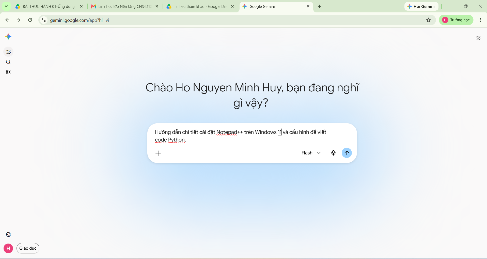
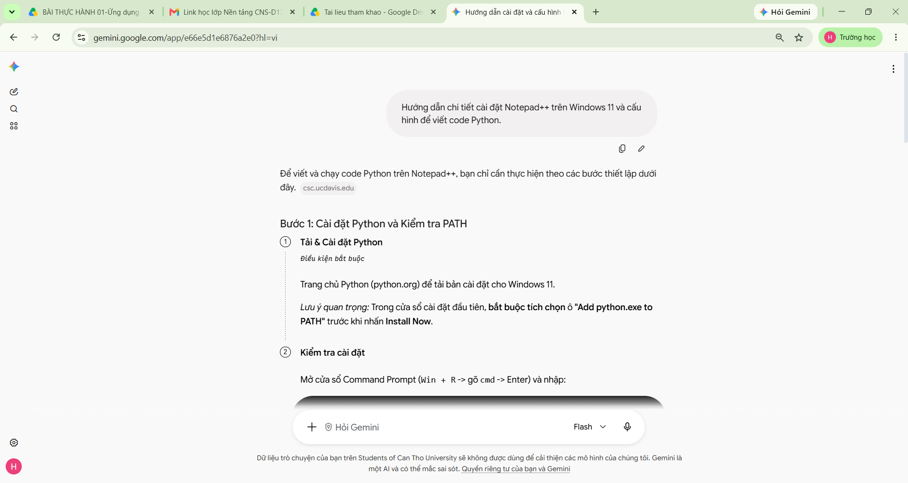
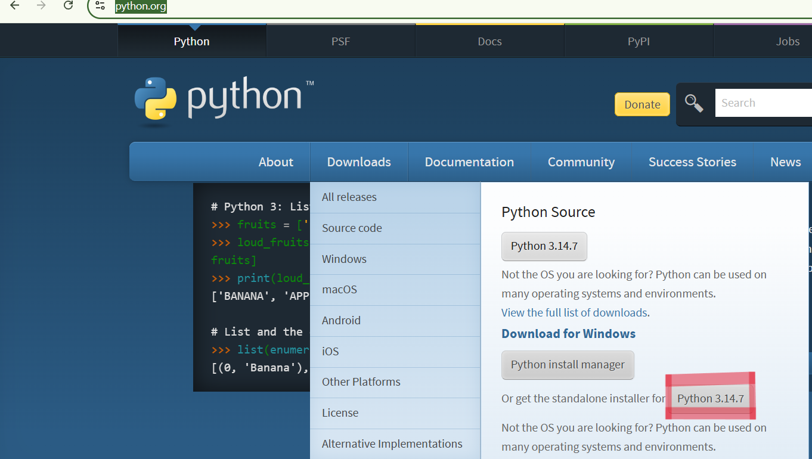
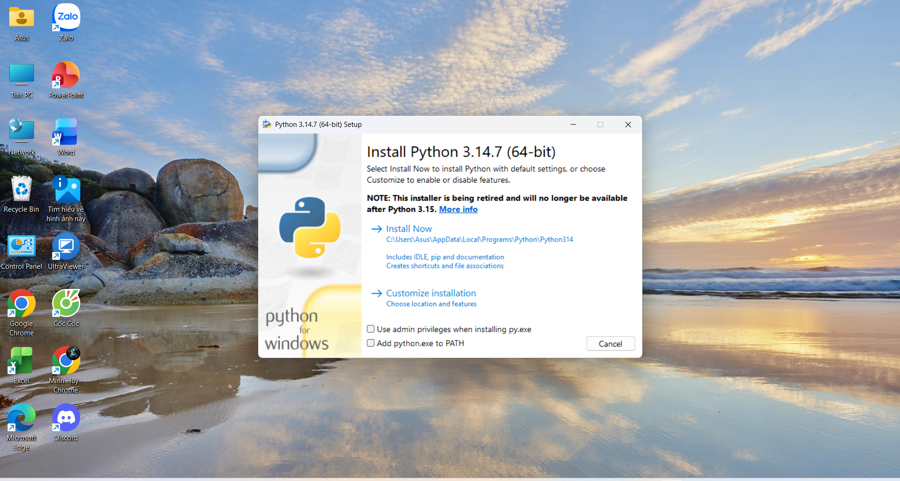
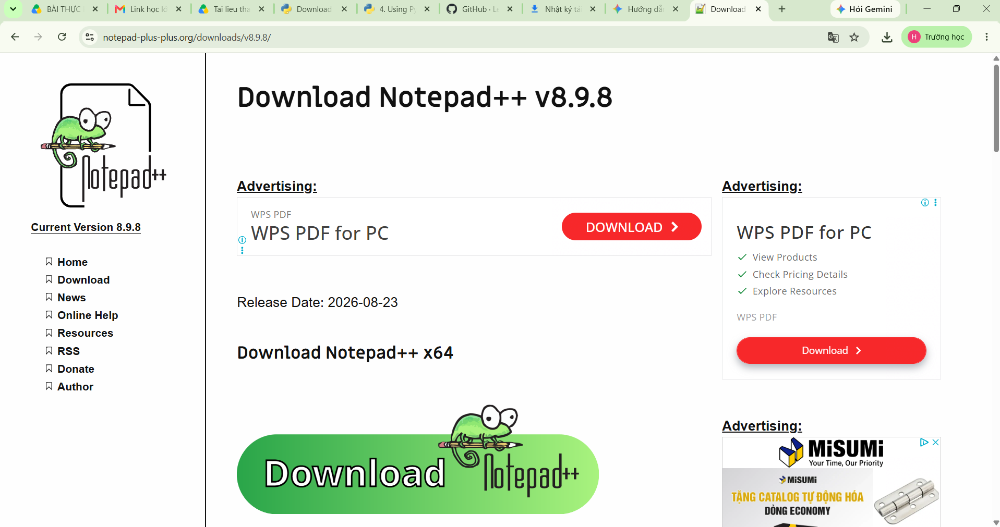
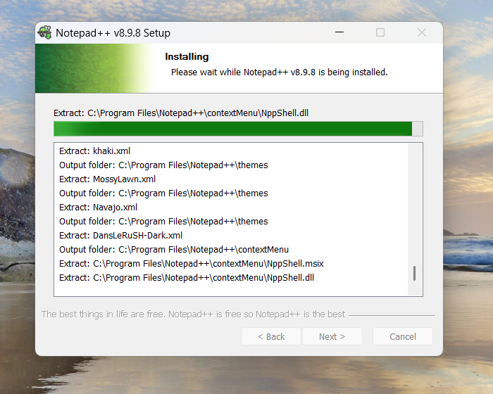
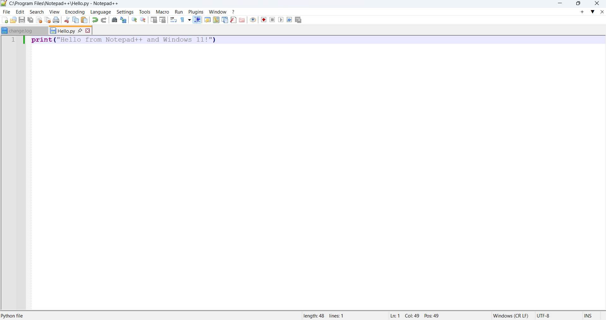
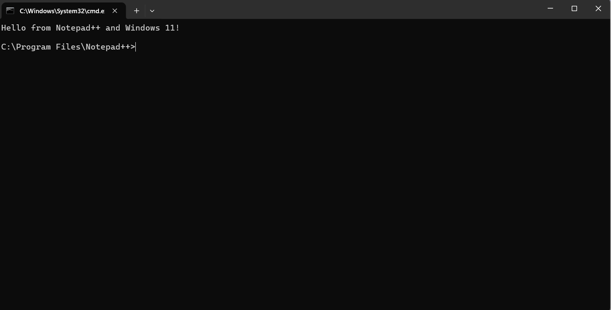

&nbsp;&nbsp;&nbsp;&nbsp;&nbsp;&nbsp;&nbsp;&nbsp;&nbsp;&nbsp;&nbsp;&nbsp;&nbsp;&nbsp;&nbsp;&nbsp;&nbsp;&nbsp;&nbsp;&nbsp;&nbsp;&nbsp;&nbsp;&nbsp;&nbsp;&nbsp;&nbsp;&nbsp;&nbsp;&nbsp;&nbsp;&nbsp;&nbsp;&nbsp;&nbsp;**Nhiệm vụ 1.2: Cấu hình phần mềm cơ bản**.  
-----
&nbsp;&nbsp;&nbsp;&nbsp;**Sử dụng AI để hỗ trợ cài đặt và cấu hình trình duyệt Chrome hoặc phần mềm Notepad++**.

\- Truy cập vào **[Google Gemini](https://gemini.google.com/app?hl=vi)** sau đó nhập câu lệnh *“Hướng dẫn chi tiết cài đặt Notepad++ trên Windows 11 và cấu hình để viết code Python.”* 

\- **Google Gemini** sẽ đưa ra hướng dẫn và hãy làm theo  

&nbsp;&nbsp;&nbsp;&nbsp;**Cài đặt Python**  

\- Truy cập vào trang chủ **Python** ([Python.org](https://www.python.org/)), chọn mục **Downloads** và tải **Python 3.14.7**  

\- Mở file vừa tải về, chọn **Add python.exe to PATH** rồi bấm **Install Now**  

&nbsp;&nbsp;&nbsp;&nbsp;**Cài đặt Notepad++**   

\- Truy cập trang **[notepad-plus-plus.org](https://notepad-plus-plus.org/)**, chọn **Current version** và bấm **Download** 

\- Mở file **Notepad++** vừa tải về và bấm **Ok** -> **Next** -> **I Agree** -> **Next** -> **Next** và đợi **Install**

&nbsp;&nbsp;&nbsp;&nbsp;**Chạy chương trình**

\- Mở Notepad++, nhấn tổ hợp phím Ctrl + N để tạo trang mới  

\- Nhập thử đoạn code print("Hello from Notepad++ and Windows 11!)

  

\- Bấm **Run** hoặc **F5** để chạy lệnh

