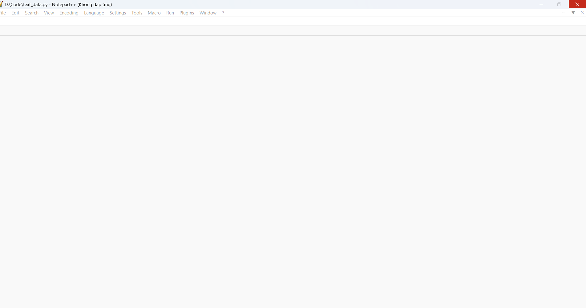
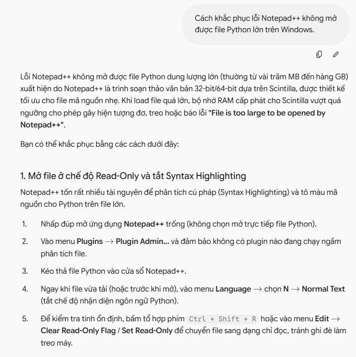
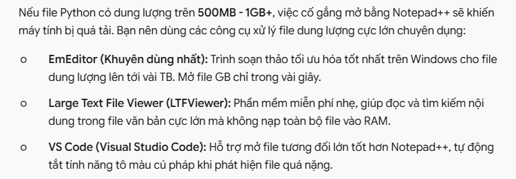
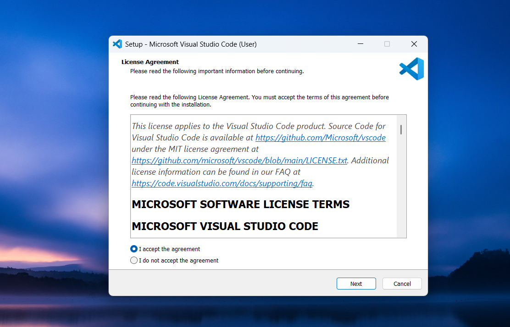
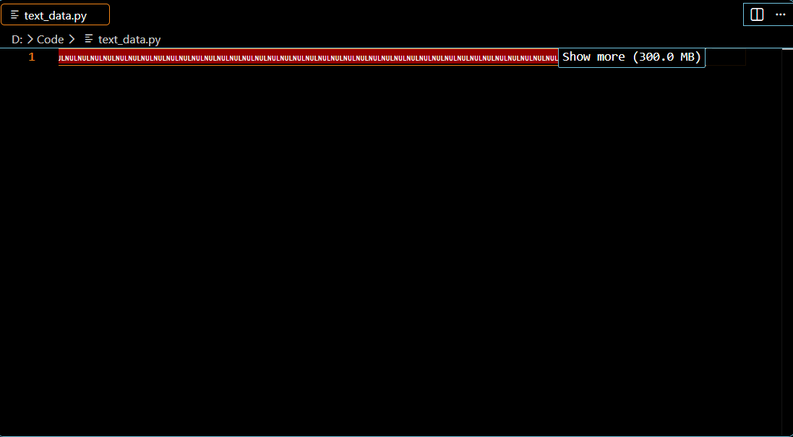

#                 &nbsp;&nbsp;&nbsp;&nbsp;&nbsp;&nbsp;&nbsp;&nbsp;&nbsp;&nbsp;&nbsp;&nbsp;&nbsp;&nbsp;&nbsp;&nbsp;&nbsp;&nbsp;&nbsp;&nbsp;&nbsp;&nbsp;&nbsp;&nbsp;**Nhiệm vụ 2.2: Xử lý lỗi phần mềm cơ bản**  
&emsp;&emsp;&emsp;&emsp;&emsp;&emsp;&emsp;&emsp;&emsp;&emsp;&emsp;&emsp;&emsp;&emsp;&emsp; **Sử dụng AI để khắc phục lỗi “Notepad++ không mở được file Python lớn”.**  
&emsp;&emsp;&emsp;&emsp;&emsp;&emsp;&emsp;&emsp;&emsp;&emsp;&emsp;&emsp;&emsp;&emsp;&emsp;&emsp;&emsp;&emsp;&emsp;&emsp;&emsp;&emsp;&emsp;&emsp;&emsp;&emsp;&emsp;&emsp;**BÁO CÁO**  

\- Khi mở file **Python** trên **NotePad++**, **Notepad++** bị treo (_Not Responding_), do phần mềm được thiết kế tối ưu cho file mã nguồn nhẹ. Khi load file quá lớn sẽ gây ra hiện trạng đơ máy

\- Truy cập **[Google Gemini](https://gemini.google.com/app)** và nhập promt _"Cách khắc phục lỗi Notepad++ không mở được file Python lớn trên Windows."_  

\- **Google Gemini** đưa ra các giải pháp sau: 

  

\- Làm theo cách tải **VsCode**  

-Mở lại file Python trên **VsCode** và kết quả **THÀNH CÔNG**  

